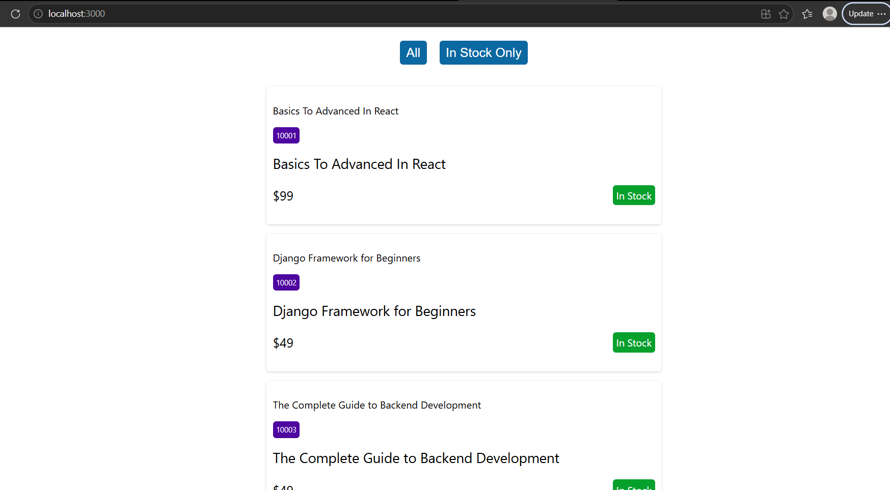

# Practical 2 - Shopmate

Shopmate is a React practice app that fetches product data from a local JSON server and lets you switch between all products and in-stock products.

## Overview

The app demonstrates data fetching with both a direct `useCallback` + `useEffect` approach and a reusable custom hook. It also shows loading and error handling for API requests.

## Product Data Source

The product cards are fetched from the local JSON server endpoint:

- [All products](http://localhost:8000/products)
- [In-stock products](http://localhost:8000/products?in_stock=true)
- [Local data file](data/db.json)

## Screenshot



## Features

- Product list fetched from `http://localhost:8000`
- Filter buttons for all products and in-stock products
- Reusable `useFetch` custom hook
- Loading and error states while the request is in progress
- Local `db.json` data source for `json-server`

## Available Scripts

In the project directory, run:

- `npm start` - start the React development server on `http://localhost:3000`
- `npm test` - launch the test runner
- `npm run build` - create a production build in `build/`
- `npm run eject` - expose the CRA build configuration

## Running the API

This project expects a JSON server to be available on port `8000`.

```bash
npx json-server --watch data/db.json --port 8000
```

## Notes

This practical is focused on API fetching patterns, reusable hooks, and conditional rendering.
