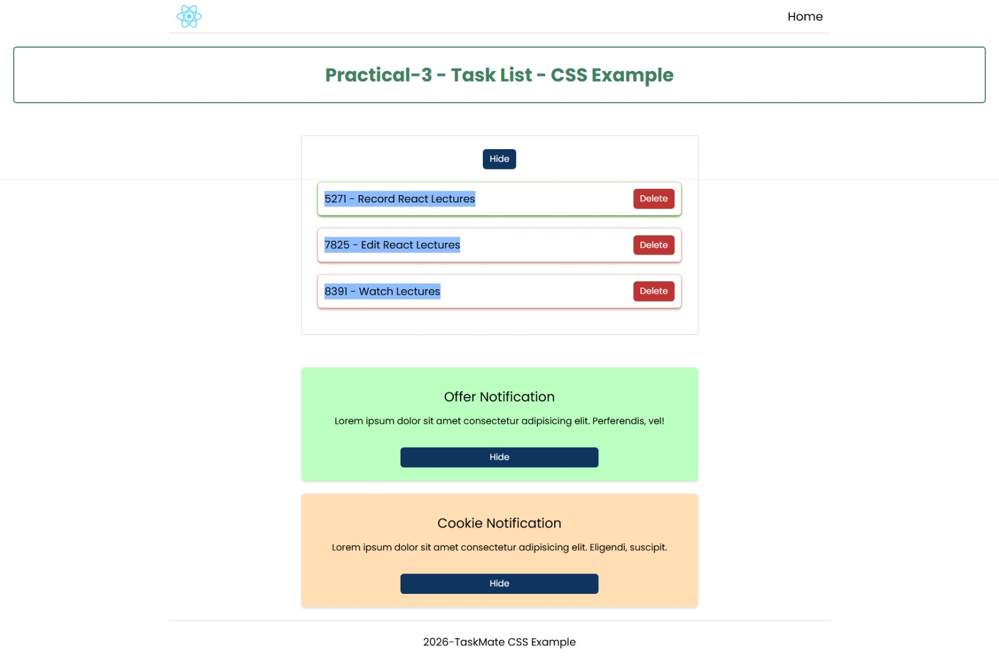

# Practical 3 - Task CSS Example

This React practice app demonstrates task list rendering with component-level CSS, inline styles, and conditional UI behavior.

## Overview

The project shows a static task list with delete actions, a show/hide toggle, and reusable notification-style cards built with `BoxCard`.

## Screenshot



## Features

- Task list rendered from local component state
- Show and hide toggle for the task list
- Delete task action handled in the parent list
- Inline style changes based on component state
- Reusable `TaskCard` and `BoxCard` components
- Example success and warning notification blocks

## Styling Approaches

This practical uses three styling styles side by side so you can compare them clearly.

### 1. Module Based Styling

CSS modules scope styles to a single component, so the class name does not leak into other files. In this project, `TaskCard` uses `taskCard.module.css`.

Example:

```jsx
import styles from "./taskCard.module.css";

<span className={styles.title}>{task.id} - {task.name}</span>
```

And in `taskCard.module.css`:

```css
.title {
	background-color: rgb(142, 189, 255);
}
```

### 2. Inline Styling

Inline styles are written directly in the component as a JavaScript object and passed with the `style` prop. In this project, the heading in `TaskList` changes color and border based on the `show` state.

Example:

```jsx
const styles = {
	color: show ? "#3D8361" : "#be3434",
	border: "2px solid",
	borderColor: show ? "#3D8361" : "#be3434",
	borderRadius: "5px",
	fontSize: "28px",
	padding: "20px"
};

<h1 style={styles}>Practical-3 - Task List - CSS Example</h1>
```

### 3. Normal CSS Files

Regular CSS files are imported directly into the component and apply global class-based styles. This project uses files like `taskCard.css`, `taskList.css`, and `boxCard.css`.

Example:

```jsx
import "./taskCard.css";

<li className={task.completed ? "completed" : "incomplete"}>
```

And in `taskCard.css`:

```css
.taskcard li.completed {
	box-shadow: rgb(48, 114, 0) 0px 1px 4px;
}
```

## When To Use Each One

- Use CSS modules when you want component-scoped styles and fewer naming conflicts.
- Use inline styles when the style depends on React state or props and changes dynamically.
- Use normal CSS files when you want reusable styles shared across components.

## Available Scripts

In the project directory, run:

- `npm start` - start the Vite development server
- `npm run build` - create a production build in `dist/`
- `npm run preview` - preview the production build locally

## Notes

This practical focuses on component styling patterns, conditional rendering, and simple list state management.
