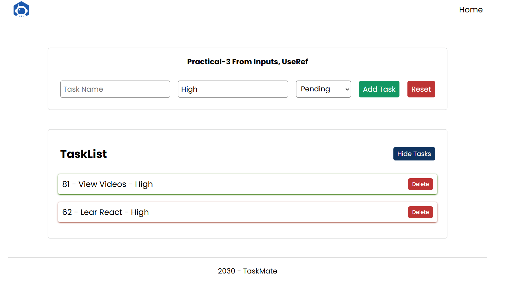

# Practical 5 - Taskmate Add

Taskmate Add extends the task list practice app with a form for creating new tasks, priority input, and completion status selection.

## Overview

The app keeps tasks in parent state and passes the list plus setter into the add form and task list components. It also demonstrates `useRef` for accessing form input values without storing them in state.

## Screenshot

## Features

- Add new tasks from a form
- Capture task name, priority, and completion status
- Use `useRef` for the priority field
- Reset the form after submit
- Toggle task visibility
- Delete tasks from the list

## Available Scripts

In the project directory, run:

- `npm start` - start the Vite development server
- `npm run build` - create a production build in `dist/`
- `npm run preview` - preview the production build locally

## Notes

This practical is focused on form handling, parent-child state sharing, and working with both controlled and uncontrolled inputs.
