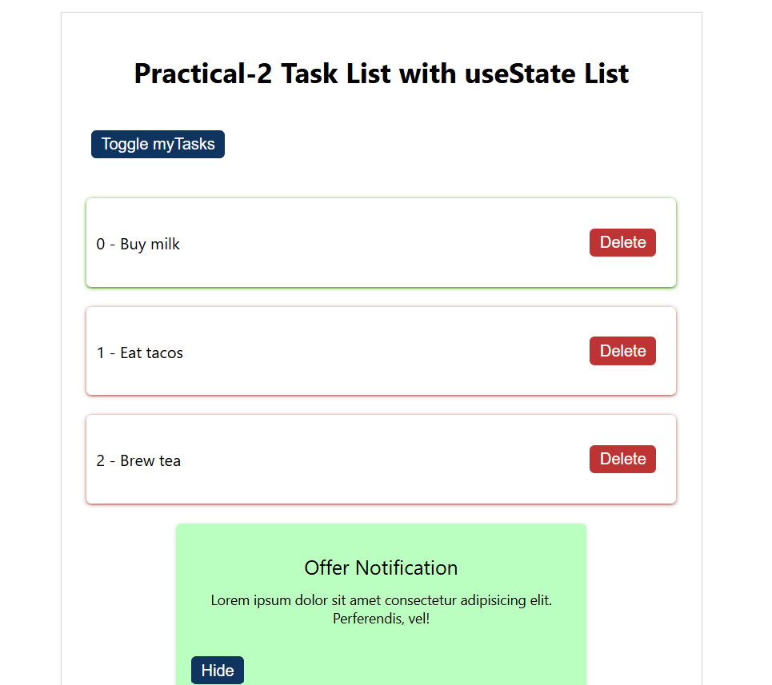
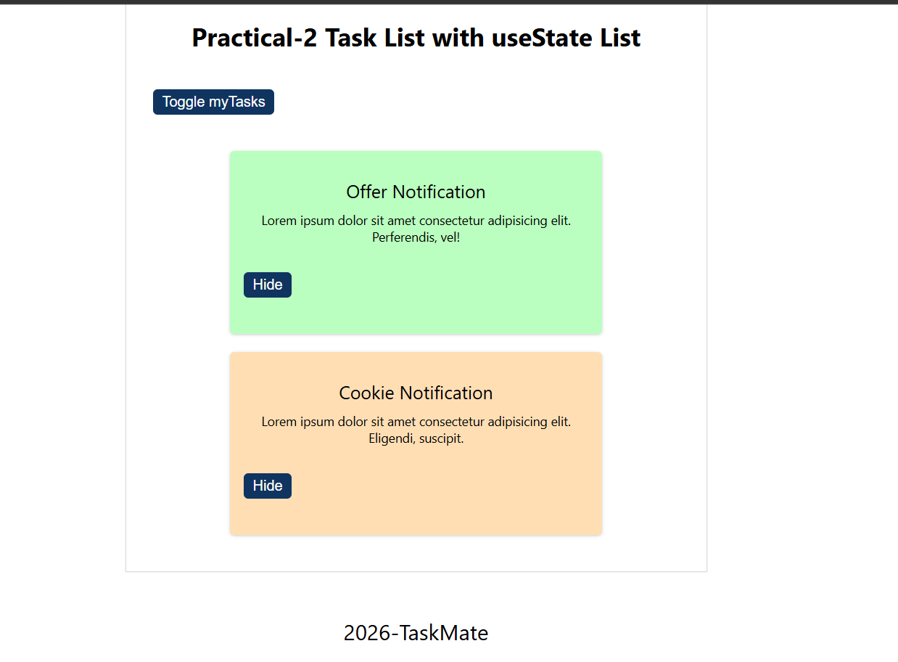

# Practical 4 - Taskmate

Taskmate is a React practice app focused on list state, reusable components, and simple UI composition with a header, counter, task list, and footer.

## Overview

The app keeps a small local task list in state and demonstrates toggling visibility, deleting items, and passing props into child components.

## Screenshot

## Features

- Header, counter, task list, and footer sections
- Local task list managed with `useState`
- Toggle button to show or hide tasks
- Delete action for individual tasks
- Reusable notification-style `BoxCard` components

## Available Scripts

In the project directory, run:

- `npm start` - start the Vite development server
- `npm run build` - create a production build in `dist/`
- `npm run preview` - preview the production build locally

## Notes

This practical is useful for practicing props, state updates, and rendering lists from arrays.
